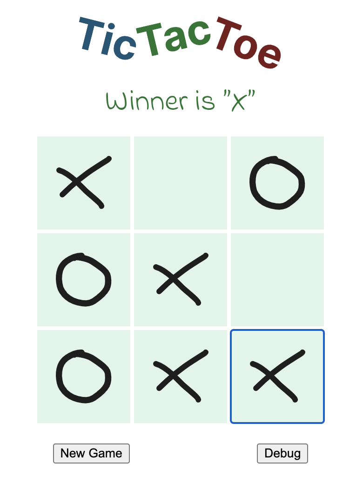

## React Studies - Tic Tac Toe
If you are following the React tutorial, the first code exercise you'll see is the **TicTacToe** game implementation using React. Here's the link to the tutorial: https://react.dev/learn/tutorial-tic-tac-toe

While the way they coded it is fine, I find it a lot more difficult to come up with a good implementation taking the approach they suggest, which is focused on the components first, and logic that matters later.

The approach I took here goes in the opposite direction. Instead of start building up the game cell, then board and after that add logic to bring the game to life, I started by creating a class representing the game itself (**[TicTacToeGame](https://github.com/ismaels/react-studies/blob/main/tic-tac-toe.js#L55)**), with all the logic necessary to start a new game, play it and check for a winner.

Once that was concluded, translate the game board state into the UI was a breeze.

### How do I run this project?
This project uses Parcel Bundler (https://parceljs.org). In order to run it locally follow these steps:
1. Install the dependencies with `npm install` or `yarn install`
2. Once installed, you can the project with: `npm run dev` or `yarn dev`
3. Open http://localhost:1234 on your browser and you're done.

### Screenshot
